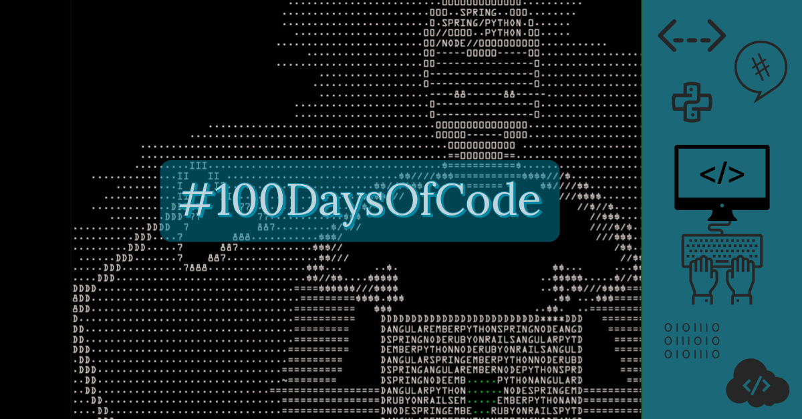

## Round 3 of 100DaysOfCode

My journey 3º Round through 100 days of code.

Minha 3ª jornada do desafio 100 dias de código de Machine Learning
**

## Round 3 - 23/100 - 18/07/2021 - Sunday
Santander course Data Science Completed ! 
#100DaysOfCode

## Round 3 - 22/100 - 17/07/2021 - Saturday
Santander course Full Stack Completed ! 
#100DaysOfCode

## Round 3 - 21/100 - 16/07/2021 - Friday
Qwiklabs challenge ! 
https://go.qwiklabs.com/future-proof-your-career?utm_source=medium&utm_medium=blog&utm_campaign=future-proof-your-career
#100DaysOfCode

## Round 3 - 20/100 - 15/07/2021 - Thursday
Qwiklabs Benefits! 
https://qwiklabs.medium.com/qwiklabs-on-youtube-membership-with-benefits-999ef2f7b025  
#100DaysOfCode

## Round 3 - 19/100 - 14/07/2021 - Wednesday
Getting updates about Docker
#100DaysOfCode

## Round 3 - 18/100 - 13/07/2021 - Tuesday
Updating some things on Terraform 
#100DaysOfCode

## Round 3 - 17/100 - 12/07/2021 - Monday
Taking exams - SQL databricks course
#100DaysOfCode

## Round 3 - 16/100 - 11/07/2021 - Sunday
Round D 2021 - Kick start by Google
#100DaysOfCode

## Round 3 - 15/100 - 10/07/2021 - Saturday
AZ-900 - Azure Fundamentals Course finished - Semantix
#100DaysOfCode

## Round 3 - 14/100 - 09/07/2021 - Friday
Big Data Business Course finished - Semantix
#100DaysOfCode

## Round 3 - 13/100 - 08/07/2021 - Thursday
Fundamentals of Databricks SQL Course finished - Databricks
#100DaysOfCode

## Round 3 - 12/100 - 07/07/2021 - Wednesday
Delta Lake Course finished - Databricks
#100DaysOfCode

## Round 3 - 11/100 - 06/07/2021 - Tuesday
First class on Semantix Course - Big Data Business
#100DaysOfCode

## Round 3 - 10/100 - 05/07/2021 - Monday
Data Scientist Formation Course finished - DSA - Data Science Academy
#100DaysOfCode

## Round 3 - 9/100 - 04/07/2021 - Sunday
Web Scraping and Data Analysis Course finished - DSA - Data Science Academy
#100DaysOfCode

## Round 3 - 8/100 - 03/07/2021 - Saturday
Data Governance Course finished - DSA - Data Science Academy
#100DaysOfCode

## Round 3 - 7/100 - 02/07/2021 - Friday
Time Series Analysis Course finished - DSA - Data Science Academy
#100DaysOfCode

## Round 3 - 6/100 - 01/07/2021 - Thursday
I win a scholarship from Santander! Hurruh 
#100DaysOfCode

## Round 3 - 5/100 - 30/06/2021 - Wednesday
Taking exams on Semantix for a scholarship - 
#100DaysOfCode

## Round 3 - 4/100 - 29/06/2021 - Tuesday
Taking exams on Santander for a scholarship - fullstack
#100DaysOfCode

## Round 3 - 3/100 - 28/06/2021 - Monday
covariance vs. mutual information
https://lnkd.in/dp45NN2
Thx Ari Seff for share this(Twitter).
#100DaysOfCode
 
https://twitter.com/ari_seff/status/1409296508634152964

## Round 3 - 2/100 - 27/06/2021 - Sunday
PaddleGAN is very fun! 
https://github.com/PaddlePaddle/PaddleGAN 
#100DaysOfCode
 

## Round 3 - 1/100 - 26/06/2021 - Saturday
Start of Journey - Round 3! 
#100DaysOfCode
 

