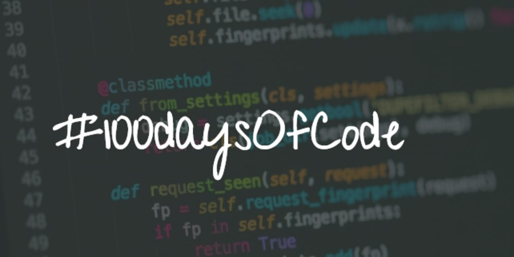

<h1 align="center">
    
     
    100DaysOfCode
</h1>
<h4 align="left">
My logbooks for #100DaysOfCode, if you don´t know what is it, look -> https://www.100daysofcode.com/
</h4>

 
    
   
   

## :rocket: Tracks

Follow me on twitter  https://twitter.com/gortaina and see my track on this journey.

 

| Track           | Status      |
| :--------------: |:-----------:|
|[Logbook Round 2](https://github.com/gortaina/100DaysOfCode/blob/master/100DaysOfCode_Round2.md) | In progress :construction: | 
|[Logbook Round 1](https://github.com/gortaina/100DaysOfCode/blob/master/100DaysOfCode_Round1.md) | Complete :bookmark:|

 
 
 
 

To code :construction_worker:
* [Daily Coding Problem](https://github.com/gortaina/100DaysOfCode/blob/master/Daily_Coding_Problem_2020.md)

___
### Contact
>[  Joel Melo](https://www.linkedin.com/in/joeldemelo/) 
>[   arquitetura.joel@gmail.com](mailto:arquitetura.joel@gmail.com) 
>:octocat:[  gortaina](https://github.com/gortaina) 
>[  gortaina](https://twitter.com/gortaina)

 
:trollface:Utils:trollface:
<h6>https://gitmoji.carloscuesta.me/</h6>

